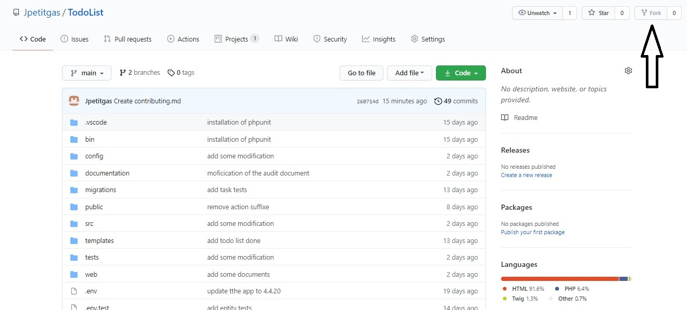

# Contributor's Guide

Issues can be submitted by anyone.

## Contents

* Getting Started
* Submitting a Pull Request
* Testing
* Code Quality

## Getting Started

1. Fork the project on GitHub. Help Guide to Fork a Repository.
2. Clone the project: 
3. Create a branch specific to the issue you are working on. git checkout -b update-xxx (For clarity, name your branch update-xxx or fix-xxx. The xxx is a short description of the changes you're making.)
4. Open up the project in your favorite text editor, select the file you want to contribute to, and make your changes.
5. Implement your change and add tests for it.
6. Ensure the test suite passes.
7. Commit your changes using a descriptive commit message: git commit -m "Brief Description of Commit"
8. Push your commits to your GitHub Fork: git push -u origin branch-name
9. Submit a pull request.

## Submitting a Pull Request

If you decide to fix an issue, it's advisable to check the comment thread to see if there's somebody already working on a fix. If no one is working on it, kindly leave a comment stating that you intend to work on it. That way other people don't accidentally duplicate your effort.

In a situation whereby somebody decides to fix an issue but doesn't follow up for a particular period of time, say 2-3 weeks, it's acceptable to still pick up the issue but make sure to leave a comment.

## Testing

### PHPUnit in local

To launch tests in local you need to load data fixtures in a test database. First, create a .env.test.local file. Inside, just setup the DATABASE_URL environment variable with your local db credentials. From your terminal with your own local environment :

* php bin/console doctrine:database:create --env=test
* php bin/console doctrine:migrations:migrate --env=test
* php bin/console doctrine:fixtures:load --env=test

## Code Quality

* By contributing to this project, please ensure to maintain a Grad A quality level from Codacy.
* phpcs is using in local, follow PSR rules, at the minimum PSR-1, PSR-2 and PSR-4:
vendor/bin/php-cs-fixer fix src
* In addition, respect as much as possible the SOLID principles.
